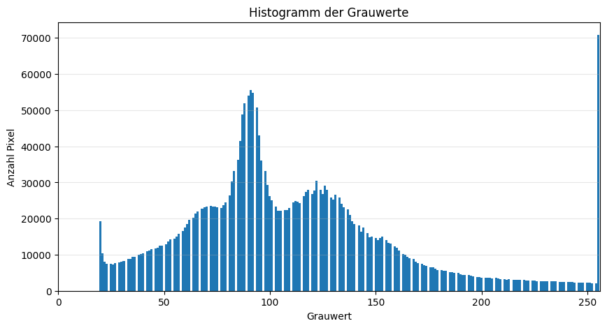

# Aufgabe 08: Graustufen und Bildanalyse

Dieses Repository enthält den Code und die Ergebnisse für die Belegaufgabe **„Aufgabe 08: Graustufen und Bildanalyse“** im Kurs **Programmierkonzepte und Algorithmen** (HTW Berlin,  Semester 2026).

Aufgaben des Projekts sind:

- a. Laden Sie ein RGB-Bild und wandeln Sie es in ein Graustufenbild um.
- b. Passen Sie anschließend Helligkeit und Kontrast des Bildes an.
- c. Berechnen Sie zum Schluss das Histogramm der Grauwerte und stellen Sie es geeignet dar

Die Aufgaben werden auf 2 Laptops mit unterschiedlichen Specs ausgeführt:

1. Laptop:
- Prozessor  Intel(R) Core(TM) Ultra 7 258V, 2200 MHz, 8 Kern(e), 8 logische(r) Prozessor(en)
- GPU: Intel(R) Arc(™) 140V GPU (16GB)

2. Laptop: xxx


Es sollen 2/3 Varianten verglichen werden:


| Variante | Name                 | Aufgabe                                   |
| -------- | ----------------------- | ------------------------------------------- |
| 1        | Baseline / CPU      | Version ohne Parallelisierung       |
| 2        | OpenCV/ CPU (optional)  | optimierte fertige Bibliothek zum Vergleich |
| 3        | PyOpenCL / GPU |  parallele OpenCL-Version             |


Histogramme der Grauwerte

<table>
  <tr>
    <td></td>
    <td></td>
  </tr>
  <tr>
    <td align="center">640×415</td>
    <td align="center">1024×663</td>
  </tr>
  <tr>
    <td></td>
    <td></td>
  </tr>
  <tr>
    <td align="center">1280×829</td>
    <td align="center">2048×1327</td>
  </tr>
</table>


| Laptop   | Bildgröße | CPU-Zeit | PyOpenCL-Zeit | OpenCV-Zeit | Speedup |
| -------- | --------: | -------: | ------------: | ----------: | ------: |
| Laptop 1 |   640×415 |        … |             … |           … |       … |
| Laptop 1 |  1024×663 |        … |             … |           … |       … |
| Laptop 1 |  1280×829 |        … |             … |           … |       … |
| Laptop 1 | 2048×1327 |        … |             … |           … |       … |
| Laptop 2 |   640×415 |        … |             … |           … |       … |
| Laptop 2 |  1024×663 |        … |             … |           … |       … |
| Laptop 2 |  1280×829 |        … |             … |           … |       … |
| Laptop 2 | 2048×1327 |        … |             … |           … |       … |


## Getting Started

### Dependencies

- Python 3.10+
- NumPy
- Matplotlib
- PyOpenCL
- OpenCV

### Installing

Repository klonen:

```bash
git clone url
cd 
```

## Authors 
Maxim Schmidt HTW Berlin (M.Sc. Applied Computer Science) Maxim.Schmidt@Student.HTW-Berlin.de

xxxxxxx

## License  


## Acknowledgments 


