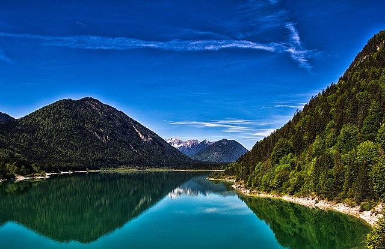
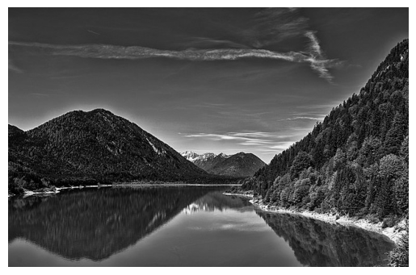
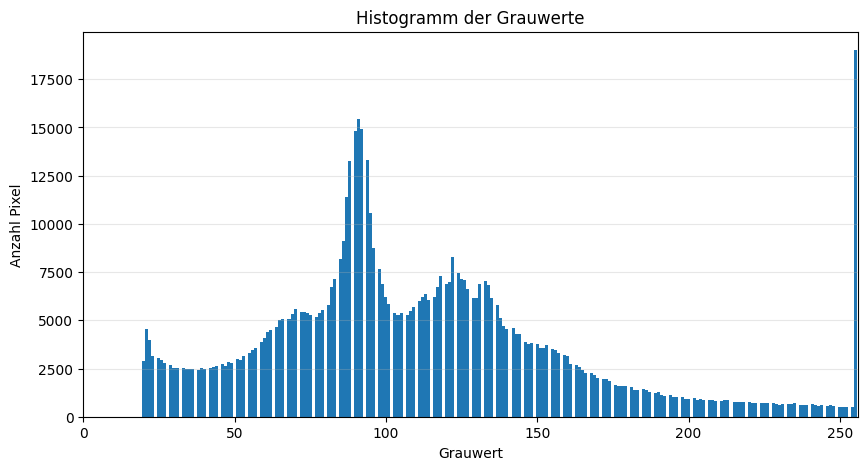
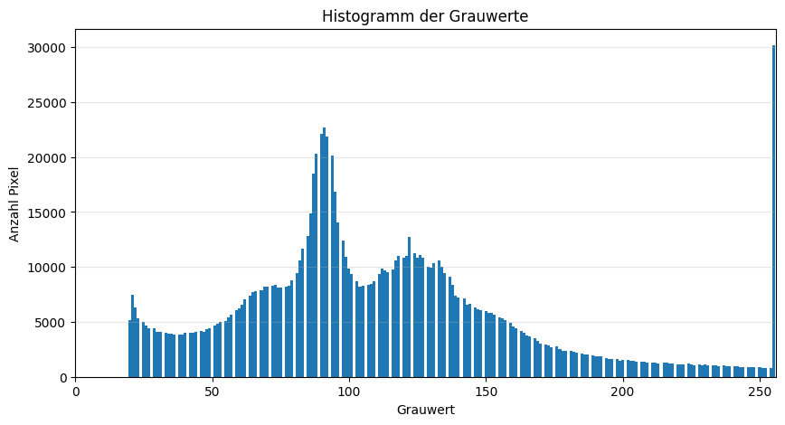
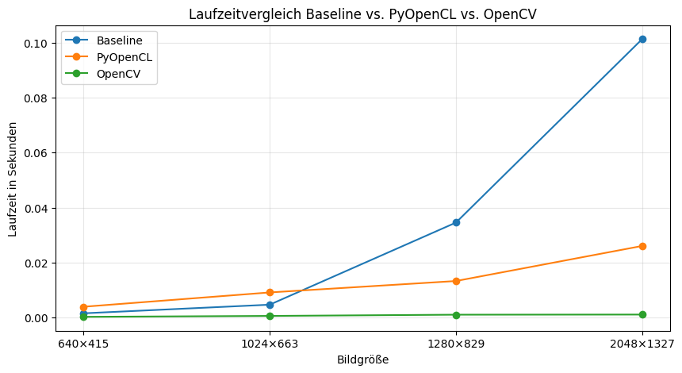
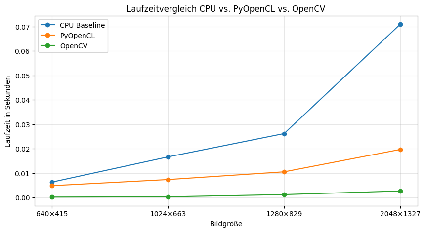
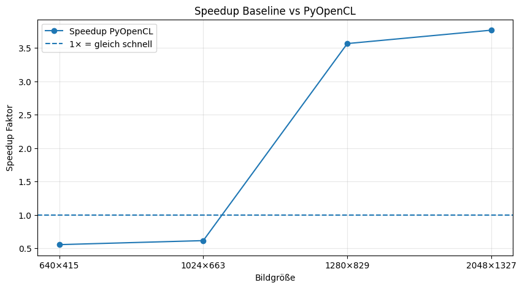
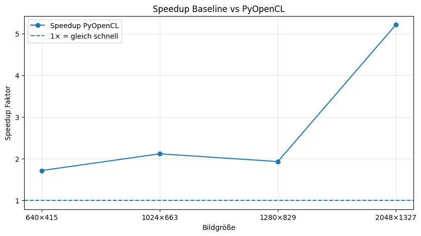
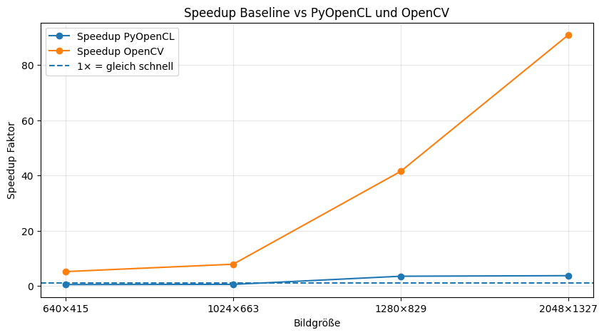
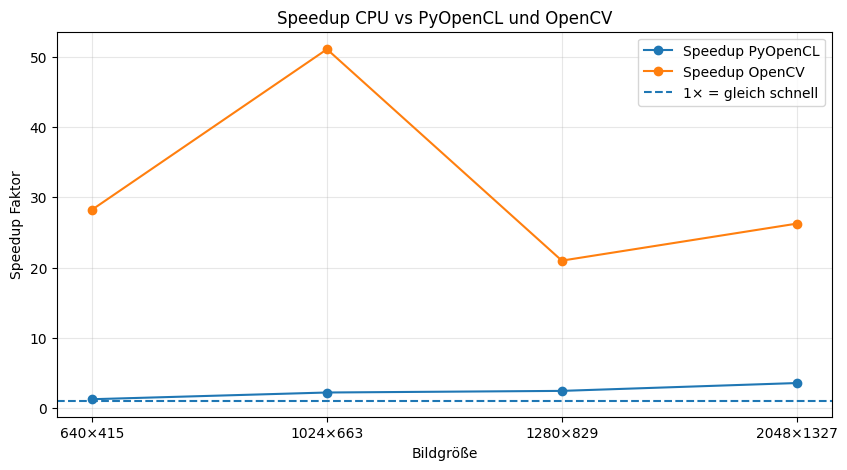

# Aufgabe 08: Graustufen und Bildanalyse

Dieses Repository enthält den Code und die Ergebnisse für die Belegaufgabe **„Aufgabe 08: Graustufen und Bildanalyse“** im Kurs **Programmierkonzepte und Algorithmen** (HTW Berlin,  Semester 2026).

Aufgaben des Projekts sind:

- a. Laden Sie ein RGB-Bild und wandeln Sie es in ein Graustufenbild um.
- b. Passen Sie anschließend Helligkeit und Kontrast des Bildes an.
- c. Berechnen Sie zum Schluss das Histogramm der Grauwerte und stellen Sie es geeignet dar
- d. Laufzeit und Speedup vergleichen

Die Aufgaben werden auf 2 Laptops mit unterschiedlichen Specs ausgeführt:

| Laptop | Prozessor | GPU |
| ------ | --------- | --- |
| 1 | Intel(R) Core(TM) Ultra 7 258V, 2200 MHz, 8 Kerne, 8 logische Prozessoren | Intel(R) Arc(TM) 140V GPU, 16 GB |
| 2 | Intel(R) Core(TM) i7-10870H CPU @ 2.20 GHz, 8 Kerne, 16 logische Prozessoren | NVIDIA GeForce RTX 3050 Laptop GPU, 4 GB |

Es werden 3 Varianten verglichen werden:


| Variante | Name                 | Aufgabe                                   |
| -------- | ----------------------- | ------------------------------------------- |
| 1        | Baseline / CPU      |  ohne Parallelisierung       |
| 2        | OpenCV/ CPU |  optimierte C++ Bibliothek für Bildverarbeitung |
| 3        | PyOpenCL / GPU |  mit Parallelisierung             |

## Ergebnisse:

a. + b.

<table width="100%">
  <tr>
    <td width="30%"></td>
    <td align="center" width="5%">></td>
    <td width="30%"></td>
    <td align="center" width="5%">></td>
    <td width="30%"></td>
  </tr>
  <tr>
    <td align="center">Originalbild</td>
    <td></td>
    <td align="center">8a: Graustufenbild</td>
    <td></td>
    <td align="center">8b: Helligkeit/Kontrast erhöht</td>
  </tr>
</table>

c.

<table width="100%">
  <tr>
    <td width="50%"></td>
    <td width="50%"></td>
  </tr>
  <tr>
    <td align="center">640×415</td>
    <td align="center">1024×663</td>
  </tr>
  <tr>
    <td width="50%"></td>
    <td width="50%"></td>
  </tr>
  <tr>
    <td align="center">1280×829</td>
    <td align="center">2048×1327</td>
  </tr>
</table>

d.
<h3>Laufzeitvergleich</h3>

<table width="100%">
  <tr>
    <td align="center" width="50%">
      
    </td>
    <td align="center" width="50%">
      
    </td>
  </tr>
  <tr>
    <td align="center">
      Laptop 1: Laufzeitvergleich Baseline vs. PyOpenCL vs. OpenCV
    </td>
    <td align="center">
      Laptop 2: Laufzeitvergleich Baseline vs. PyOpenCL vs. OpenCV
    </td>
  </tr>
</table>

<h3>Speedup: Baseline vs. PyOpenCL</h3>

<table width="100%">
  <tr>
    <td align="center" width="50%">
      
    </td>
    <td align="center" width="50%">
      
    </td>
  </tr>
  <tr>
    <td align="center">
      Laptop 1: Speedup Baseline vs. PyOpenCL
    </td>
    <td align="center">
      Laptop 2: Speedup Baseline vs. PyOpenCL
    </td>
  </tr>
</table>

<h3>Speedup: Baseline vs. PyOpenCL und OpenCV</h3>

<table width="100%">
  <tr>
    <td align="center" width="50%">
      
    </td>
    <td align="center" width="50%">
      
    </td>
  </tr>
  <tr>
    <td align="center">
      Laptop 1: Speedup Baseline vs. PyOpenCL und OpenCV
    </td>
    <td align="center">
      Laptop 2: Speedup Baseline vs. PyOpenCL und OpenCV
    </td>
  </tr>
</table>

| Laptop | Bildgröße | Baseline-Zeit in s | PyOpenCL-Zeit in s | OpenCV-Zeit in s | Speedup PyOpenCL | Speedup OpenCV |
| ------ | --------: | ------------: | -----------------: | ---------------: | ----------------: | -------------: |
| Laptop 1 | 640×415 | 0.001549 | 0.003929 | 0.000269 | 0.394116 | 5.758647 |
| Laptop 1 | 1024×663 | 0.004687 | 0.009142 | 0.000599 | 0.512666 | 7.820137 |
| Laptop 1 | 1280×829 | 0.034549 | 0.013296 | 0.001045 | 2.598381 | 33.046631 |
| Laptop 1 | 2048×1327 | 0.101295 | 0.026052 | 0.001093 | 3.888150 | 92.646499 |
| Laptop 2 | 640×415 | 0.006263 | 0.003250 | 0.000221 | 1.927281 | 28.357249 |
| Laptop 2 | 1024×663 | 0.015714 | 0.005481 | 0.000324 | 2.866923 | 48.536677 |
| Laptop 2 | 1280×829 | 0.026051 | 0.006350 | 0.001158 | 4.102779 | 22.491517 |
| Laptop 2 | 2048×1327 | 0.065415 | 0.010128 | 0.002656 | 6.458996 | 24.626397 |

## Interpretation
Die Ergebnisse zeigen deutliche Unterschiede zwischen den drei Implementierungsvarianten.

- Die Baseline ist die langsamste Variante, besonders bei größeren Bildern. Das ist zu erwarten, weil das Bild Schritt für Schritt mit NumPy-Operationen auf der CPU verarbeitet wird. Dabei werden große Arrays mehrfach gelesen und geschrieben, was zusätzliche Speicherzugriffe und Laufzeit verursacht.

- PyOpenCL ist auf beiden Laptops schneller als die Baseline. Der Vorteil wird vor allem bei größeren Bildern sichtbar, weil mehr Pixel parallel auf der GPU verarbeitet werden können. Gleichzeitig hat PyOpenCL aber auch Overhead. Die Bilddaten müssen in ein eindimensionales Array umgewandelt, in GPU-Buffer kopiert, vom OpenCL-Kernel verarbeitet und anschließend wieder in den Arbeitsspeicher zurückkopiert werden. Bei kleinen Bildern wirkt sich dieser Overhead stärker aus, wodurch der Speedup kleiner sein kann. Ein zentraler Punkt war, dass in einer früheren Version das Histogramm (8c) noch mit `np.bincount` auf der CPU berechnet wurde, obwohl 8a und 8b bereits auf der GPU liefen. Nach der Umstellung auf einen eigenen OpenCL-Kernel mit atomaren Operationen (`atomic_inc`) wird nun auch das Histogramm vollständig parallel auf der GPU berechnet. Dadurch stieg der Speedup von PyOpenCL gegenüber der Baseline deutlich an, besonders bei größeren Bildern (z. B. Laptop 2, 2048×1327: Speedup von 3.60 auf 6.46), da weniger Daten zwischen CPU und GPU transferiert werden mussten und der CPU-Anteil im PyOpenCL-Pfad entfiel.

- OpenCV ist in fast allen Messungen die schnellste Variante. Das liegt daran, dass OpenCV stark optimierte native C/C++ Funktionen für Bildverarbeitung verwendet. Diese Funktionen sind deutlich effizienter als die einfache eigene CPU-Implementierung und vermeiden außerdem einen großen Teil des manuellen GPU-Overheads von PyOpenCL.

Der Vergleich zwischen Laptop 1 und Laptop 2 zeigt, dass die Laufzeit nicht nur vom Namen der CPU oder GPU abhängt. Auch Treiber, OpenCL-Implementierung, OpenCV-Version, Speicherbandbreite, Energieeinstellungen und Hintergrundprozesse können das Ergebnis beeinflussen. Besonders bei kleinen Bildern sind die gemessenen Laufzeiten sehr kurz, sodass kleine Unterschiede auch durch Messrauschen entstehen können.

Insgesamt zeigt die Aufgabe, dass Bildverarbeitung ein datenparalleles Problem ist. Parallelisierung mit PyOpenCL kann die Laufzeit verbessern, besonders bei größeren Bildern. Für diese konkrete Aufgabe ist OpenCV jedoch die beste praktische Lösung, weil es am schnellsten und gleichzeitig am einfachsten zu verwenden ist. PyOpenCL ist trotzdem sinnvoll, um zu verstehen, wie GPU-Parallelisierung intern funktioniert.

## Getting Started

### Dependencies

- Python 3.10+
- NumPy
- Matplotlib
- PyOpenCL
- OpenCV

### Installing

Repository klonen:

```bash
git clone url
cd 
```

## Authors 
Maxim Schmidt HTW Berlin (M.Sc. Applied Computer Science) Maxim.Schmidt@Student.HTW-Berlin.de

Sarra Malek HTW Berlin (M.Sc. Applied Computer Science) Sarra.Malek@Student.HTW-Berlin.de

## License  

This project is licensed under the MIT License.

## Acknowledgments

https://documen.tician.de/pyopencl/index.html </br>
https://opencv-tutorial.readthedocs.io/en/latest/
